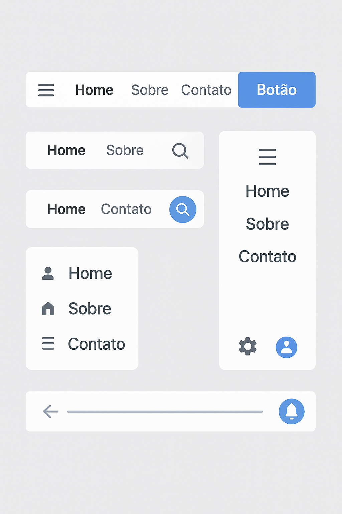

## 📁 Estrutura do Repositório

Clique nas imagens abaixo para navegar para a respectiva pasta:

  
  

---

## 📄 Documentação

O repositório está organizado em pastas temáticas, cada uma contendo exemplos e arquivos prontos para uso.  
Todos os arquivos estão prontos para serem copiados ou personalizados conforme seu projeto.
